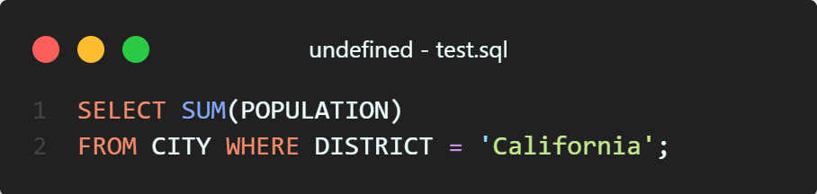
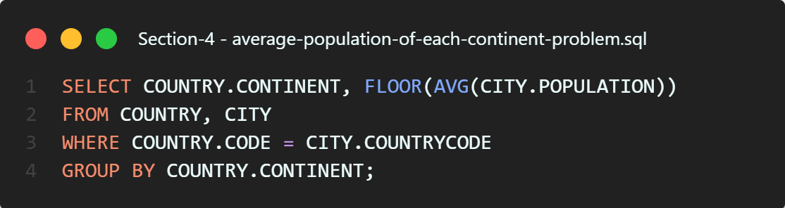

# MySQL-Queries_M70-HW11_last_Version
MySQL-Queries_M70-HW11_last_Version

## 1. Revising the Select Query I

```sql
SELECT NAME FROM CITY WHERE COUNTRYCODE = 'USA' AND POPULATION >= 120000;
```

<p align="center">
  
</p>


## 2. Revising the Select Query II

```sql
SELECT * FROM CITY WHERE POPULATION > 100000 AND COUNTRYCODE = 'USA';
```


## 3. Select All

```sql
SELECT * FROM CITY;
```


## 4. Select By ID

```sql
SELECT * FROM CITY WHERE ID = 1661;
```


# Section 2

## 1. Weather Observation Station 3

```sql
SELECT NAME FROM EMPLOYEE
ORDER BY NAME;
```


## 2. Employee Names

```sql
SELECT NAME FROM EMPLOYEE
WHERE SALARY > 2000
AND MONTHS < 10
ORDER BY EMPLOYEE_ID;
```


## 3. Employee Salaries

```sql
SELECT DISTINCT(CITY) FROM STATION
WHERE (ID % 2 ) = 0;
```


# Section 3

## 1. Revising Aggregations - The Count Function

```sql
SELECT FLOOR(AVG(POPULATION)) FROM CITY;
```


## 2. Revising Aggregations - The Sum Function

```sql
SELECT SUM(POPULATION) FROM CITY
WHERE DISTRICT = 'California';
```




## 3. Revising Aggregations - Averages

```sql
SELECT AVG(POPULATION) FROM CITY
WHERE DISTRICT = 'California';
```


## 4. Average Population

```sql
SELECT COUNT(*) FROM CITY
WHERE POPULATION > 100000;
```


## 5. Population Density Difference

```sql
SELECT MAX(POPULATION) - MIN(POPULATION) FROM CITY;
```


# Section 4

## 1. African Cities

```sql
SELECT CITY.NAME FROM CITY
INNER JOIN COUNTRY ON CITY.COUNTRYCODE = COUNTRY.CODE
WHERE COUNTRY.CONTINENT = 'Africa';
```


## 2. Population Census

```sql
SELECT SUM(CITY.POPUALTION) FROM CITY
INNER JOIN COUNTRY ON CITY.COUNTRYCODE = COUNTRY.CODE
WHERE COUNTRY.CONTINENT = 'Asia';
```


## 3. Average Population of Each Continent

```sql
SELECT COUNTRY.CONTINENT, FLOOR(AVG(CITY.POPULATION))
FROM COUNTRY, CITY
WHERE COUNTRY.CODE = CITY.COUNTRYCODE
GROUP BY COUNTRY.CONTINENT;
```


